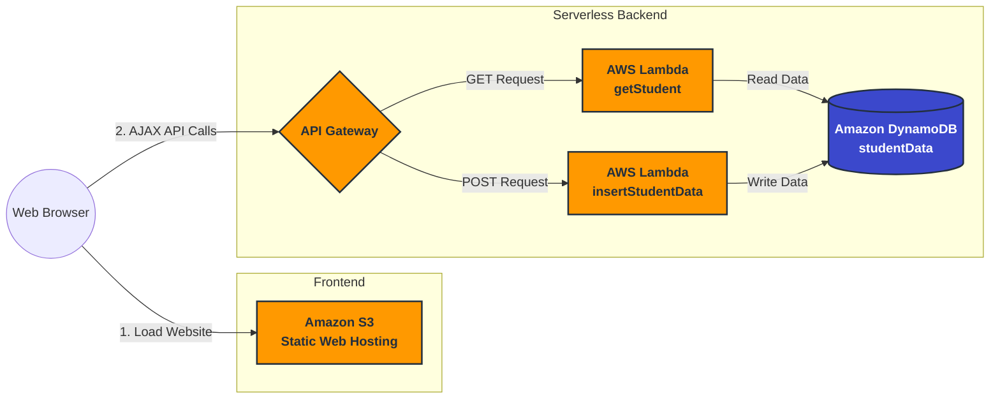

# Serverless Student Data Portal on AWS

## Introduction

This project is a fully serverless web application built on AWS. It provides a simple frontend interface to manage student records, allowing users to insert new student data and retrieve existing records from a NoSQL database. The architecture ensures high availability, auto-scaling, and pay-as-you-go pricing without the need to manage or provision any underlying servers.

---

## Architecture Diagram

---

## Tech Stack

- Frontend: HTML5, CSS, Vanilla JavaScript
- Hosting: Amazon S3 (Static Website Hosting)
- API Management: Amazon API Gateway (REST API, Edge-Optimized)
- Compute: AWS Lambda (Python 3.12, Boto3)
- Database: Amazon DynamoDB (NoSQL)

---

## Steps to Deploy

### 1.Database Setup (DynamoDB)

1. Create a DynamoDB table named studentData.
2. Set a Partition Key (e.g., studentID - String).
3. Leave default settings for capacity and routing.

### Compute Setup (Lambda)

1. Create an IAM Execution Role with permissions to write to CloudWatch Logs and read/write          specifically to the studentData DynamoDB table (Principle of Least Privilege).
2. Create two Python 3.12 Lambda functions:
    - getStudent: Connects to DynamoDB and retrieves all student records.
    - insertStudentData: Takes payload data and inserts a new student record into the table.

### API Setup (API Gateway)

1. Create a new REST API (Edge-optimized).
2. Add GET and POST methods to the root or a specific resource path.
3. Integrate the GET method with the getStudent Lambda function.
4. Integrate the POST method with the insertStudentData Lambda function.
5. Enable CORS on the resource to allow browser requests from your S3 domain.
6. Deploy the API to a stage (e.g., prod) and copy the generated Invoke URL.

### Frontend Configuration & Hosting (S3)

1. Open the frontend script.js file and paste the API Gateway Invoke URL where required.
2. Create a new Amazon S3 bucket.
3. In the bucket settings, turn OFF "Block all public access".
4. Enable Static website hosting in the bucket properties, specifying index.html as the index document.
5. Upload your frontend files (index.html, script.js, etc.) to the S3 bucket.
6. Apply a Bucket Policy allowing s3:GetObject access so the public can view the website.
7. Access the live site via the S3 website endpoint URL!

---

## Summary

This project demonstrates a classic and robust serverless architecture on AWS. By separating the static frontend (S3) from the backend logic (API Gateway + Lambda) and the state (DynamoDB), the application achieves massive scalability and minimal maintenance. Because it relies entirely on managed services, you only pay for the compute time and storage actually used, making it incredibly cost-effective for both small side projects and enterprise-grade applications.